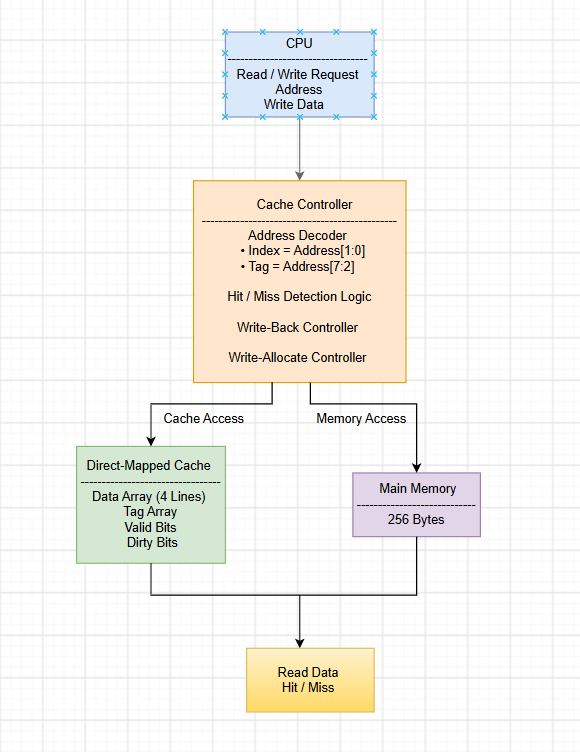
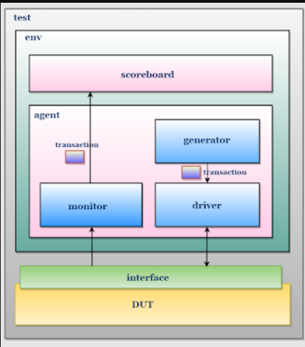
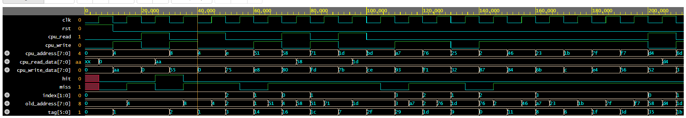
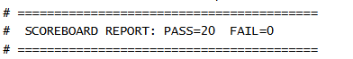

# Cache Controller Verification using SystemVerilog

> RTL implementation and class-based verification of a **Direct-Mapped Cache Controller** using **SystemVerilog** with a self-checking scoreboard, directed testing, and constrained-random verification.

---

## Project Overview

This project implements and verifies a **Direct-Mapped Cache Controller** that supports read and write operations using the **Write-Back** and **Write-Allocate** cache policies.

A complete **SystemVerilog class-based verification environment** has been developed to validate the functionality of the cache controller. The verification environment generates both directed and constrained-random transactions, drives them to the DUT, monitors the responses, and automatically checks correctness using a self-checking scoreboard.

The project demonstrates important Design Verification concepts including:

- RTL Design
- Object-Oriented Programming (OOP) in SystemVerilog
- Class-Based Testbench Architecture
- Mailbox Communication
- Directed Testing
- Constrained Random Verification
- Self-Checking Scoreboard
- Waveform Analysis

---

# Cache Specifications

| Parameter | Value |
|------------|--------|
| Cache Type | Direct-Mapped |
| Cache Lines | 4 |
| Data Width | 8-bit |
| Address Width | 8-bit |
| Main Memory | 256 Bytes |
| Write Policy | Write-Back |
| Allocation Policy | Write-Allocate |

---

# Cache Architecture

The following diagram illustrates the architecture of the Direct-Mapped Cache Controller.



---

# Verification Environment

The verification environment follows a modular SystemVerilog class-based architecture.
Architecture/Folder Structure.png
```
## Verification Environment

The project follows a modular class-based verification architecture using SystemVerilog. The environment consists of a generator, driver, monitor, scoreboard, agent, environment, interface, and test class. Transactions are generated, driven to the DUT, monitored, and verified using a self-checking scoreboard.


---

# Verification Components

### Transaction

- Defines cache transactions.
- Contains randomized stimulus.
- Supports read, write and reset operations.

### Generator

- Generates directed transactions.
- Generates constrained-random transactions.
- Sends transactions to the driver through a mailbox.

### Driver

- Receives transactions from the generator.
- Drives stimulus to the cache interface.

### Monitor

- Samples DUT inputs and outputs.
- Sends observed results to the scoreboard.

### Scoreboard

- Maintains a reference model of cache memory.
- Compares DUT output against expected results.
- Automatically reports PASS/FAIL.

### Agent

- Connects Generator, Driver and Monitor.

### Environment

- Instantiates all verification components.
- Controls the execution flow.

### Test

- Creates the environment.
- Starts the verification process.

---

# Folder Structure

```
Cache-Controller-Verification-SystemVerilog
│
├── Architecture
│   └── cache_architecture.png
│
├── RTL
│   └── cache_controller.sv
│
├── Verification
│   ├── cache_transaction.sv
│   ├── cache_generator.sv
│   ├── cache_driver.sv
│   ├── cache_monitor.sv
│   ├── cache_scoreboard.sv
│   ├── cache_agent.sv
│   ├── cache_environment.sv
│   ├── cache_test.sv
│   ├── cache_if.sv
│   └── tb_top.sv
│
├── Results
│   ├── simulation_log.txt
│   ├── simulation_output.png
│   └── scoreboard_report.png
│
├── Waveforms
│   └── cache_waveform.png
│
├── LICENSE
└── README.md
```

---

# Verification Features

- Directed Testing
- Constrained Random Verification
- Self-Checking Scoreboard
- Mailbox Communication
- Hit Verification
- Miss Verification
- Write-Back Verification
- Write-Allocate Verification
- Reset Verification

---

# Simulation Waveform

The waveform below demonstrates cache read, write, hit, miss, reset and address decoding operations.



---

# Simulation Output

Simulation completed successfully without errors.


---

# Scoreboard Report

The self-checking scoreboard verified all transactions successfully.

**Final Verification Result**

- PASS : 20
- FAIL : 0

---

# Tools Used

- SystemVerilog
- QuestaSim 2025.2
- EPWave
- EDA Playground
- GitHub

---

# Learning Outcomes

Through this project, the following concepts were implemented and verified:

- Direct-Mapped Cache Architecture
- RTL Design
- Cache Hit/Miss Logic
- Write-Back Cache Policy
- Write-Allocate Policy
- SystemVerilog Classes
- Object-Oriented Programming
- Mailbox Communication
- Generator-Driver-Monitor Architecture
- Self-Checking Scoreboard
- Constrained Random Verification
- Waveform Analysis

---

# Future Improvements

The following enhancements can be added in future versions:

- Functional Coverage
- SystemVerilog Assertions (SVA)
- Universal Verification Methodology (UVM)
- Set-Associative Cache
- Multi-Level Cache
- LRU Replacement Policy
- Burst Transactions
- Performance Metrics

---

# Author

**Saniya Vafeeka**

Final Year Electronics and Communication Engineering Student

Interested in:

- Digital Design
- RTL Design
- Design Verification
- SystemVerilog
- VLSI

GitHub: https://github.com/Saniyavafeeka09

---

## Repository Highlights

- RTL Design of Direct-Mapped Cache Controller
- Complete SystemVerilog Class-Based Verification Environment
- Directed + Constrained Random Testing
- Self-Checking Scoreboard
- Simulation Waveforms
- Verification Results
- Well-Organized Project Structure

---

⭐ If you found this project useful, consider giving it a star!
